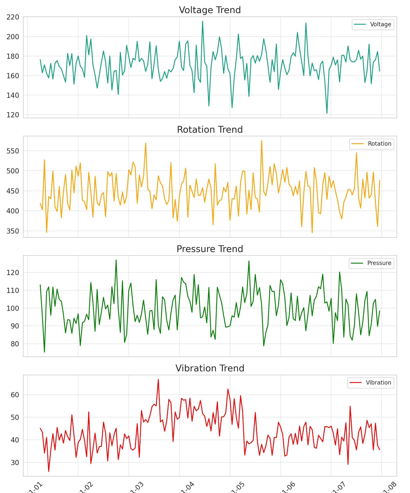
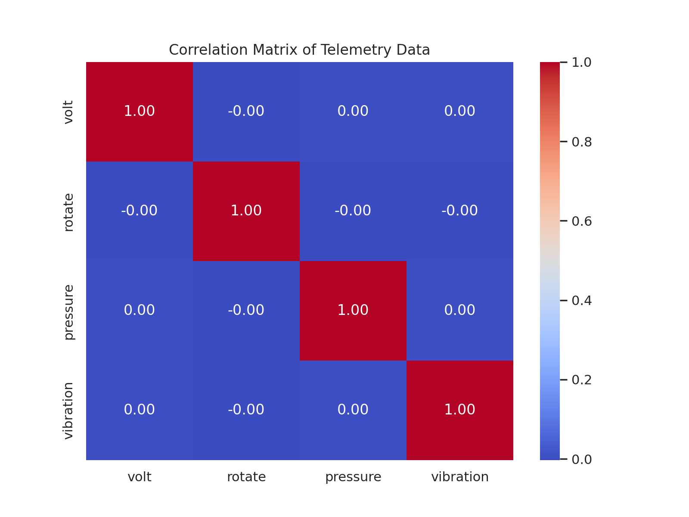
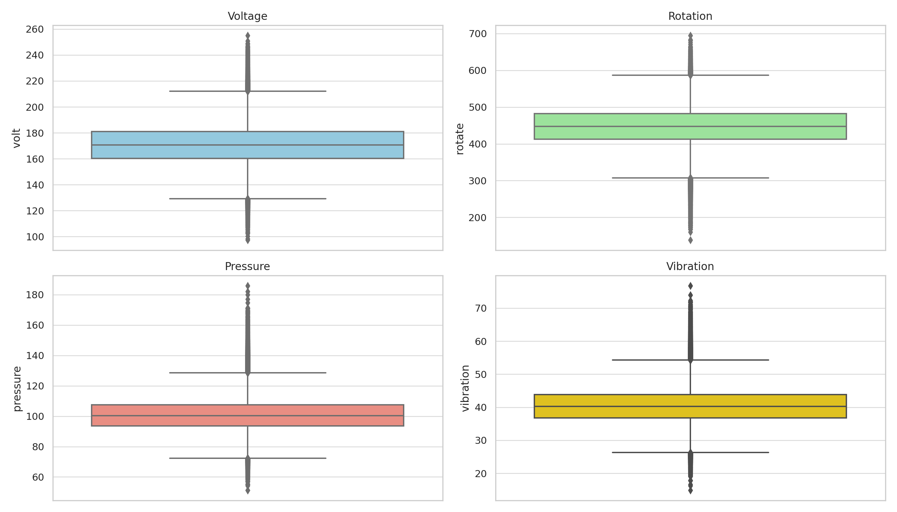
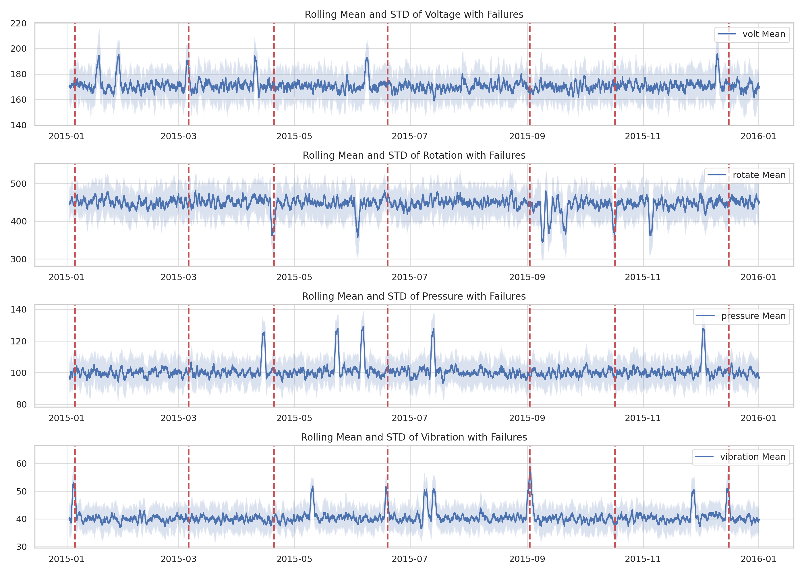
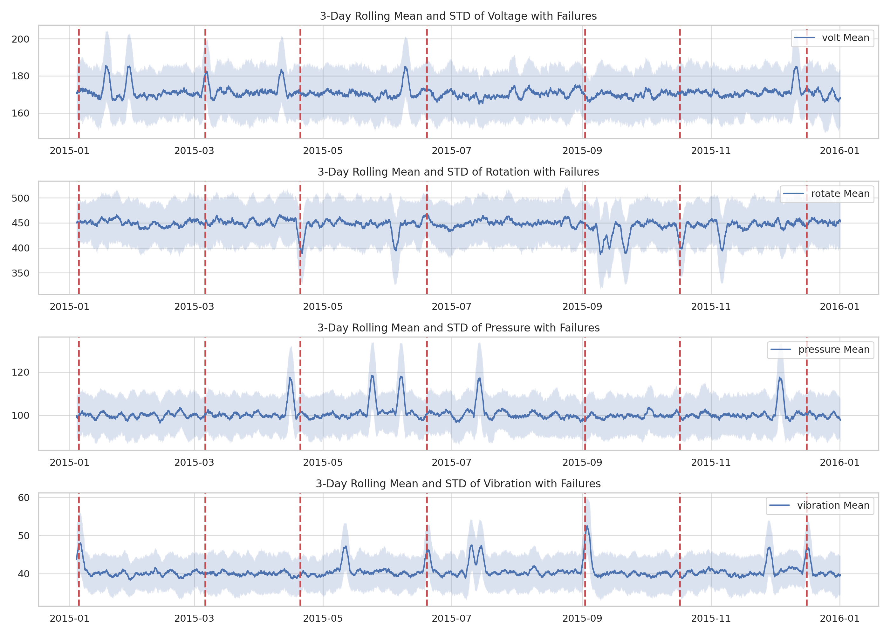
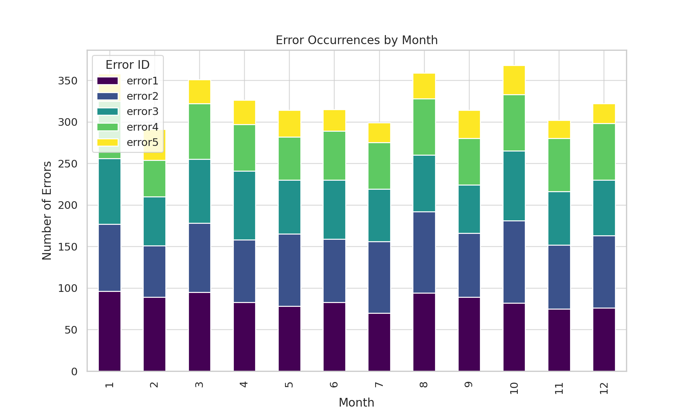
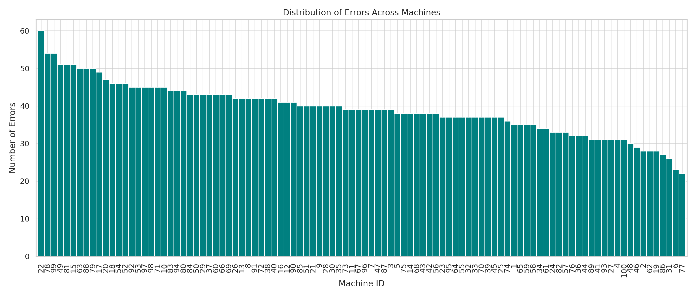
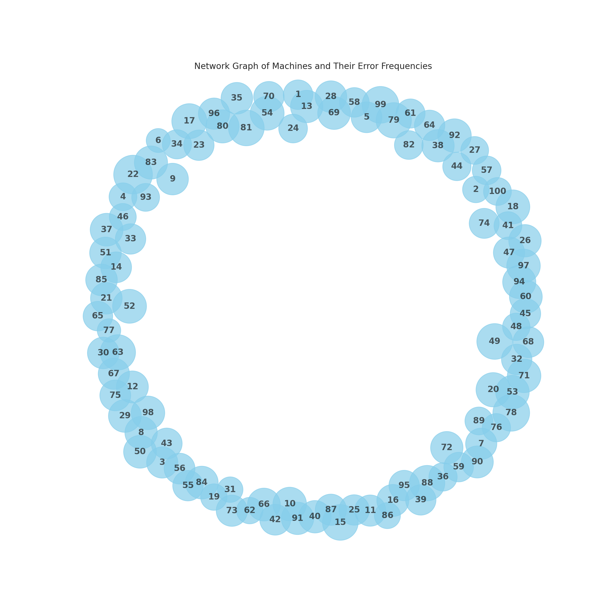
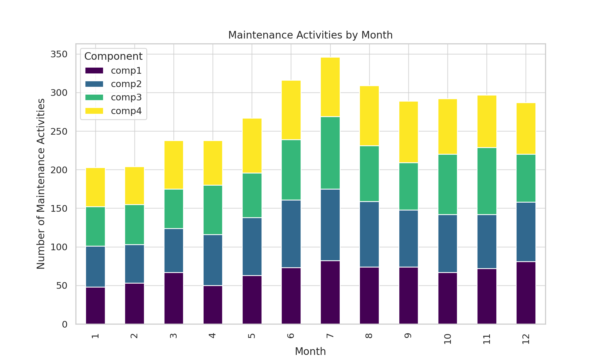
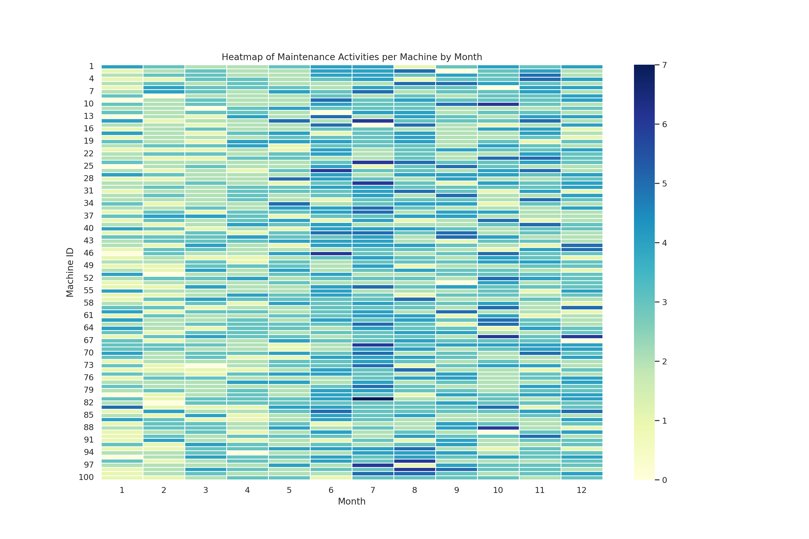

Following report is entirely generated by the Code Interpreter Plugin available through ChatGPT-Plus.

- Dataset used: [Microsoft Azure Predictive Maintenance](https://www.kaggle.com/datasets/arnabbiswas1/microsoft-azure-predictive-maintenance)
- Chat Interations to explor the data: [Data Exploration](https://chat.openai.com/share/fca66ade-cf07-415b-a729-6d5eaf10323b)

At the end of the exploration I asked the plugin to create a zip file consisting of all the visulaizations and a markdown file describing the data, so that I can present it to my customer. And here it is.

# Predictive Maintenance Analysis Report

## Summary Statistics

### Telemetry Data
- **Number of Records:** 8,116,083
- **Number of Machines:** 100
- **Time Period:** January 1, 2015 - January 1, 2016

### Errors Data
- **Number of Records:** 3,919
- **Number of Machines:** 100
- **Time Period:** January 1, 2015 - January 1, 2016
- **Error Types:**
  - error1: 1,010 occurrences
  - error2: 988 occurrences
  - error3: 838 occurrences
  - error4: 727 occurrences
  - error5: 356 occurrences

### Maintenance Data
- **Number of Records:** 3,286
- **Number of Machines:** 100
- **Time Period:** January 1, 2014 - January 1, 2016
- **Maintenance Components:**
  - comp1: 804 occurrences
  - comp2: 863 occurrences
  - comp3: 808 occurrences
  - comp4: 811 occurrences

## Telemetry Data Analysis
Analysis of telemetry data revealed patterns in voltage, rotation, pressure, and vibration across machines. Rolling averages and standard deviations were calculated to smooth out the data and highlight trends.

- 
- 
- 
- 
- 

## Errors Data Analysis
Exploration of the errors data indicated the frequency and distribution of errors across machines. Temporal analysis highlighted potential seasonal or operational patterns.

- 
- 
- 

## Maintenance Data Analysis
The maintenance dataset was analyzed to understand the frequency and timing of maintenance activities. Maintenance activities were evenly distributed across components, with slight monthly variations.

- 

Frequency of Maintenance Activities per Machine by Month

- 